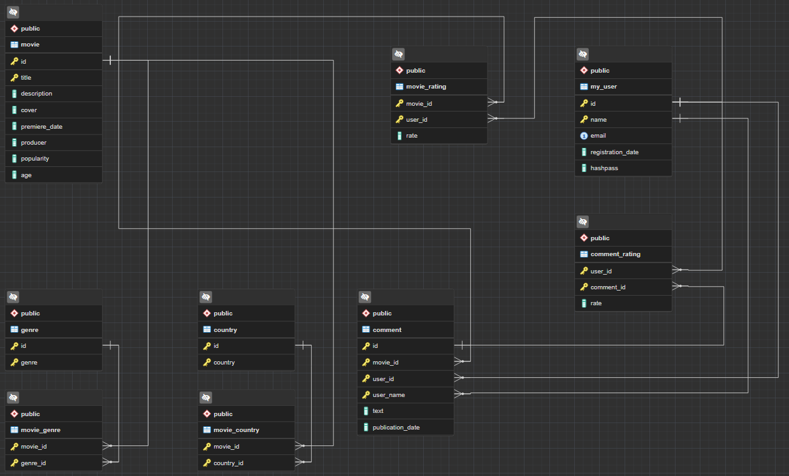

# [XD] 
###### by AntonCkya
Вторая версия серверной части кинотеатра [xd]
```
Python            3.10.5
fastapi           0.87.0
pydantic          1.10.2
uvicorn           0.19.0
SQLAlchemy        1.4.44
psycopg2          2.9.5
email-validator   1.3.0
```
Перед запуском создать базу данных: (Указать в файле хоста, юзера, пароль)
```
python create_db.py
```
Запуск сервера:
```
uvicorn main:app --reload
```
 


Схема базы данных:      
